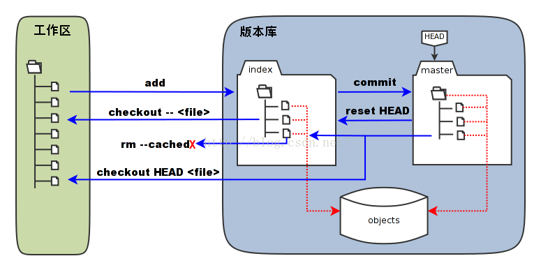
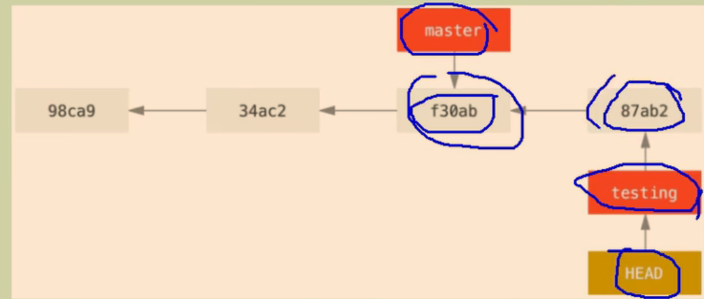
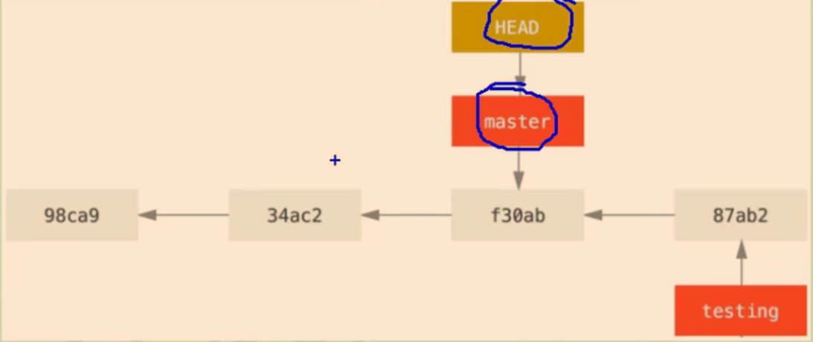
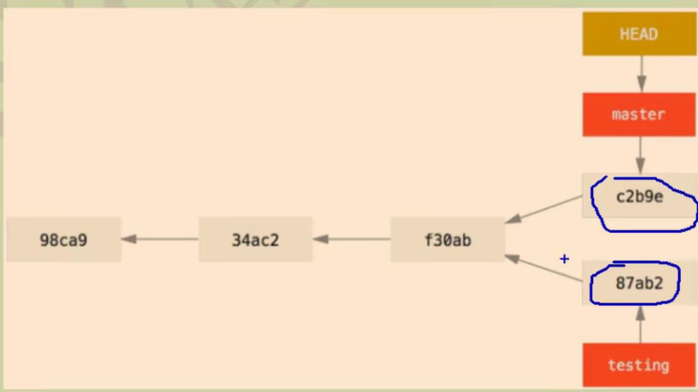

# Git
## 基础命令

#### 初始化
```
    git init
//之后会生成.git隐藏文件，不要动它
```

```
设置项目级别：
    git config user.name ""
    git config user.email ""
/系统用户级别：
    git config --global user.name ""
    //()表示要填的
    git config --global user.email ""
/查看配置信息
    git .git/config
    //前提是当前状态处于目录中，配置信息包括name和email都存储再config中
```

#### vim编辑器
```
    vim name.txt
    set nu//添加注释
    wq
```
#### 查看状态
```
    git status
```
#### 添加到暂存区
```
    git add name.txt//不要忘记后缀
```
#### cancel//从暂存区到工作区
```
    git rm --cashed name.txt
```
#### 从暂存区提交到本地库
```
    git commit (name.txt)
```
#### 修改后
```
    git add () + git commit ()
    或者 git commit -m "备注" (name.txt)//方便备注
/   git commit -a (name.txt)//直接到本地库
```
#### 查看版本记录
```
    git log
    //HEAD 指针指向当前版本
    git log --oneline//简化
    git reflog//更有用，标明移动步数
```
#### 多屏显示操作
```
    space向下翻页
    b向上翻页
    q退出
```
#### 前进后退
```
    git reset --hard (索引值)//配合git reflog获得索引值
/^: git reset --hard HEAD^^^^//有几个后退几个，只准后退
/~: git reset --hard HEAD~3//后退3步
```
- reset 的三个命令
- soft只移动本地库//status 显示绿，表示未提交
- mixed只移动本地库和暂存区//status 显示红，表示未添加
- hard都移动
- 

#### 删除本地库的文件并找回
```
    rm name.txt
+   git add name.txt
+   git commit -m "备注" name.txt
//本地库会有个删除name.txt的记录，
一样可以后退和前进。通过hard指令可以
把name.txt找回到工作区
//cat name.txt可以查看工作区（vim编辑器指令）
```

#### 删除暂存区的文件并找回
***本地库也叫版本库***
```
//即相对于上面那个未进行commit操作
    rm name.txt
+   git add name.txt
+   git reset --hard HEAD
//表示将暂存区和工作区回到HEAD指向的版本即与本地库同步
```

#### 比较文件
***git以行为单位进行存储***
```
    git diff name.txt//显示工作区？暂存区的改变
    git diff HEAD name.txt//显示版本库的改变
```

#### 分支操作
```
1.查看分支
    git branch -v
2.创建分支
    git branch 分支名
3.切换分支
    git checkout 分支名
4.合并分支
    git merge 分支名//这里是要被合并的分支
//需要提前把当前分支切换成主分支master
5.解决冲突
//当合并的两个分支出现修改同一行时就会出现冲突
    -修改文件，删除特殊标识
    -git add name.txt
    -git commit -m "日志"//注意这里不能带文件名
```

---
## Git的基本原理

#### 哈希算法
```
1.加密算法
2.相同长度
3.十六进制
4.唯一性
5.巨变性
6.不可逆性
7.不冲突
```
这里的HASH算法是密码学的基础，比较常用的有MD5和SHA，最重要的两条性质，就是不可逆和无冲突。所谓不可逆，就是当你知道x的HASH值，无法求出x；所谓无冲突，就是当你知道x，无法求出一个y， 使x与y的HASH值相同。这两条性质在数学上都是不成立的。因为一个函数必然可逆，且由于HASH函数的值域有限，理论上会有无穷多个不同的原始值，它们的hash值都相同。MD5和SHA做到的，是求逆和求冲突在计算上不可能，也就是正向计算很容易，而反向计算即使穷尽人类所有的计算资源都做不到。

#### Git文件版本管理机制
```
哈希+快照+父子链接
```

#### Git分支管理机制
***指针***





#### 关于bash的其他指令（Linux）
```
    cd . .//退出当前目录
```

---
## GitHub
#### 添加origin
```
    git remote -v//查看记录
    git remote add origin 网址
    //以后就可以用origin来替代该网址
```

#### 推送
```
    git push origin 分支名//默认是master
```

#### 克隆
```
    git clone 远程地址
    //顺便把初始化的.git也克隆了，里面备注了配置信息
    //同时也将origin来替代远程地址
```
~~Win的凭据管理器记住了密码~~
SDFGSDFSFSDFSDFSDF
为微软微软微软微软


